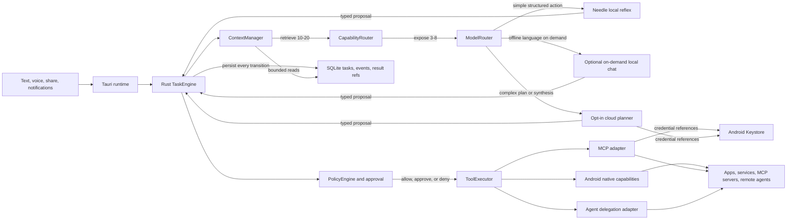

# Autonomous Agent Architecture

This document defines the target architecture for AETHRA as a general Android
agent. It extends the existing `Assistant`, capability registry, provider adapters,
MCP manager, policy engine and SQLite store. It does not replace those components.

The central rule is:

**Models decide what to propose. Rust decides what is allowed, executes it, records
the observation and drives the next step.**

The system supports open-ended tasks without encoding each scenario as a workflow.
New domains arrive as typed capabilities, MCP servers, skills or delegated agents.

## Runtime topology

## Responsibilities

### AssistantCore

The Rust core owns the durable task loop:

1. Accept text, voice, shared content or an opted-in event.
2. Retrieve relevant capabilities and skills.
3. Select a model role.
4. Ask that provider for one typed proposal.
5. Validate the proposal against the exact exposed capability version.
6. Pause for authentication, clarification or approval when required.
7. Execute one action.
8. Persist the raw result separately and add only a bounded excerpt to context.
9. Re-plan from the new observation until completion or a budget is exhausted.

Task state, retries, cancellation, deduplication, time limits and uncertain external
writes remain deterministic. A model cannot call Kotlin, MCP or another agent
directly.

### ModelRouter

Providers implement vendor-neutral contracts. A target inference response contains:

- one `AgentAction`;
- provider identity and role;
- confidence when the provider supplies it;
- measured latency and token usage when available;
- a local/cloud provenance flag;
- a normalized failure category.

Routing policy:

| Role | Default provider | Use |
| --- | --- | --- |
| Fast | Needle | Tool selection, argument extraction and simple next actions |
| Planner | Cloud reasoner | Open-ended decomposition and plan revision |
| Reasoner | Cloud reasoner | Ambiguity, synthesis, recovery and unfamiliar domains |
| Responder | Cloud or on-demand local model | Summaries, explanations and drafted replies |

Needle stays resident because its footprint is small. A larger local model is optional
and unloaded after an idle timeout. Cloud use is opt-in and receives a minimized
packet. Missing credentials or network access pauses or reroutes the task; it never
silently changes privacy mode.

Escalate from Needle when any of these conditions holds:

- the task needs a plan and the provider does not support planning;
- Needle returns an empty, invalid or low-confidence call;
- capability retrieval is repeatedly insufficient;
- the same action repeats;
- the task requires composition or synthesis;
- the user explicitly requests deeper reasoning.

The cloud model still returns typed actions through the same contract. It does not
gain broader permissions than Needle.

### Multi-tier cloud pipeline

Use model roles as deployment profiles rather than embedding model names in business
logic. The initial production setup needs two cloud profiles and one optional
provider failover:

| Tier | Profile | Invocation rule |
| --- | --- | --- |
| L0 | Deterministic Rust | Permissions, policy, capability filtering, approval and known state transitions |
| L1 | Needle | One familiar action, structured extraction or a concrete next step among a few tools |
| C1 | Balanced cloud | Normal conversation, drafting, summarization and ordinary multi-step planning |
| C2 | Strong cloud | Ambiguous cross-app tasks, plan repair, conflicting evidence or an explicitly requested deep analysis |
| Backup | Same-role second provider | C1 or C2 is unavailable, rate limited or returns an invalid response |

Do not call several cloud models for every turn. `ModelRouter` selects one profile
from deterministic task facts: required output type, plan depth, tool availability,
privacy mode, prior failures and the remaining latency/token budget. A provider may
request a handoff, but Rust validates that escalation against the task budget.

The common path is:

1. Rust normalizes the input, classifies allowed data egress and retrieves capabilities.
2. A direct, familiar command goes to Needle; a conversational or multi-step request
   goes directly to C1.
3. The selected provider receives one compact `ContextBundle`: objective, current plan,
   bounded observations, policy facts and roughly 3-8 tools.
4. The provider returns one typed proposal. Rust validates and either executes one
   action, requests approval or asks the user for missing information.
5. Native or MCP execution produces an observation. The raw result is stored separately.
6. Needle can choose routine next actions inside an accepted plan. C1 is called again
   only when new reasoning or language generation is required.
7. C2 is used when C1 cannot form or repair a coherent plan. The balanced responder
   normally produces the final user-facing answer.

Provider failure is distinct from task failure. A timeout, rate limit or service error
opens a per-provider circuit breaker and may select the configured same-role backup.
One invalid structured response may be retried with the schema error; repeated invalid
responses escalate or stop. An action with an uncertain external outcome always stops
for reconciliation and is never sent to another model for an automatic retry.

Cloud credentials are referenced through Android Keystore for a personal sideloaded
build. A distributed release should use an AETHRA gateway with short-lived device
credentials, quotas and provider routing so long-lived vendor keys are not shipped in
the APK. The gateway performs inference transport only; the device retains policy,
approvals, tool execution and durable task state.

### CapabilityRouter

The installed catalogue may contain thousands of capabilities. The model-visible
set remains bounded:

1. SQLite FTS retrieves 10-20 candidates.
2. Availability, authentication, network and policy filters remove unusable entries.
3. Relevant skills add only their required tools and scoped guidance.
4. The selected provider receives roughly 3-8 tools.
5. `capabilities.search` allows bounded recovery when the first retrieval misses.

Prefer semantic Android tools such as `contacts.search`, `notifications.list` and
`apps.open` over raw screen taps. Generic accessibility operations remain a fallback
for visible UI that has no supported API.

### PolicyEngine

Policy is evaluated after a model proposal and immediately before execution.

- Read-only observations may run without approval when the user enabled that source.
- External writes, messages, purchases and destructive actions require approval by
  default.
- Approval binds the task, plan revision, tool version and exact arguments.
- Recipient and message content are rechecked at the write boundary.
- An uncertain write is never retried automatically.
- Revoked permissions, changed schemas and changed foreground apps invalidate the
  pending action.

### ContextManager and storage

SQLite stores tasks, transitions, plans, capability metadata and references to raw
results. Raw notification bodies, MCP payloads, webpages and screen trees stay out of
normal model context. Context contains only the current objective, active plan,
relevant confirmed memory, bounded observations and the selected capabilities.

Secrets live behind references resolved from Android Keystore or a configured host
secret store. They never enter prompts, traces, normal SQLite columns or delegated
tasks.

## Protocol boundaries

### MCP

MCP supplies tools, resources and prompts. `McpManager` discovers a server, normalizes
each tool into `ToolSpec`, stores it disabled, and enables it only after review. MCP
results are untrusted observations. OAuth and connection recovery are deterministic
runtime concerns, not model reasoning.

Reference: <https://modelcontextprotocol.io/specification/draft/server/index>

### Agent protocols

`ACP` is overloaded and must not appear as a core vendor type:

- **Agent Client Protocol** connects an agent runtime to a client UI, primarily IDEs.
  AETHRA may expose this at a desktop/client boundary, but it is not the phone's
  internal orchestration protocol.
- **Agent-to-Agent (A2A)** or an Agent Communication Protocol delegates a bounded
  subtask to another agent. This belongs behind a vendor-neutral
  `DelegatedAgentAdapter`.
- An Agent Control Protocol for existing application UI may later become another
  execution adapter. Android Accessibility remains the initial implementation.

Every delegated request carries a new subtask ID, objective, allowed data classes,
deadline and capability scope. The remote response is untrusted and cannot approve or
execute a local action. Use A2A naming in new code when agent-to-agent communication is
intended, avoiding the ambiguous `ACP` acronym.

References: <https://zed.dev/acp> and <https://a2a-protocol.org/v1.0.0/>.

## Android capability layers

Use native APIs first:

- Contacts Provider for candidate search and stable contact identifiers;
- Notification Listener for opted-in recent notifications;
- notification reply actions when an app exposes them;
- Android intents for opening apps, dialers, navigation and composers;
- system APIs for alarms, media and supported settings;
- Accessibility for bounded inspection and interaction with selected apps.

WhatsApp's private database is outside AETHRA's access. The agent can use notification
content and text visible through the enabled Accessibility service. If content is not
exposed, the result must say so.

The voice adapter converts speech into the same `UserInput` contract used by text.
Continuous microphone capture requires a user-started Android foreground service with
a persistent notification. Wake detection, speech-to-text and text-to-speech remain
replaceable adapters and do not own tasks or execute tools.

## Example task flows

### Resolve a contact and send SMS

1. Cloud Planner creates an objective such as resolve recipient, prepare message,
   verify and send.
2. CapabilityRouter exposes `contacts.search` and clarification controls.
3. Needle calls `contacts.search` with the requested name.
4. One verified match continues; several matches pause for the user.
5. The responder drafts wording when the instruction is not already exact.
6. Rust requests approval for the exact number and message.
7. The Android adapter composes, rechecks and performs one send attempt.

### Report new WhatsApp messages and reply

1. `notifications.list` returns bounded WhatsApp notification records.
2. The reasoner groups them by conversation and summarizes the visible content.
3. If more context is requested, the Android adapter opens the selected conversation
   and returns a bounded visible screen observation.
4. The responder drafts a reply from the user's instruction and observed context.
5. PolicyEngine requires approval for the exact conversation and reply.
6. Android uses a notification reply action when available, otherwise the verified
   WhatsApp UI path.

### Unfamiliar task

1. Capability retrieval returns no sufficient native tool.
2. The cloud Planner refines the search or requests an enabled MCP capability.
3. If a specialized agent is configured, the runtime proposes a bounded delegation.
4. Authentication or additional data access pauses explicitly.
5. The returned result is inspected before the local task continues.

## Delivery sequence

1. **Unify inference outcomes.** Add provenance, confidence and usage metadata while
   keeping `AgentAction` vendor-neutral.
2. **General Android observations.** Add Contacts and Notification Listener adapters,
   permissions, bounded results and deterministic tests.
3. **Hybrid planning.** Connect the existing cloud provider to the Android runtime and
   implement explicit egress settings, Keystore-backed credentials and routing tests.
4. **General execution loop.** Replace the SMS-only screen loop with reusable app-open,
   inspect, select, enter-text, back and scroll operations scoped to a user-started
   session.
5. **Live MCP.** Complete discovery, enablement, OAuth pause/resume and one real service
   proof before expanding the catalogue.
6. **Agent delegation.** Add one protocol adapter only after the delegated-task contract
   and policy tests are stable.
7. **Foreground voice.** Add wake, speech and spoken status on top of the same runtime;
   it must not create a second agent loop.

## Acceptance gates

- Zero unapproved external writes and destructive actions.
- Zero secret values in prompts, logs, traces and normal SQLite fields.
- Model-visible tool count remains bounded as the catalogue grows.
- Every task is cancellable and survives process restart at a safe boundary.
- Repeated calls, stale observations and uncertain outcomes stop deterministically.
- Cloud egress is visible, minimized and disabled when the user selects local-only.
- MCP schema changes disable affected tools until reviewed.
- Delegated agents cannot widen capability or data scope.
- Physical-device tests cover contacts, notifications, app changes, revoked
  permissions, cancellation and ambiguous recipients.
