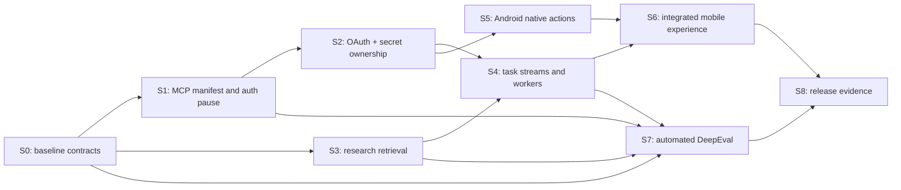

# Backend work packages for vertical slices

`VERTICAL_SLICE_PLAN.md` is the authoritative execution sequence. This file contains
the detailed backend work packages consumed by that sequence. A coordinator assigns
only the package portion named in a VS checkpoint; a worker must not implement an
entire package when the work packet scopes it more narrowly.

A slice is complete only when its end-to-end behaviour, deterministic checks, and
stated evidence are present. It is intentionally backend-first: React and Kotlin work
only consume a Rust contract that has already passed its slice checks. Do not claim a
live provider, OAuth, or device pass from mocks.

| Backend package | Authoritative slice/checkpoint |
| --- | --- |
| S0 | VS00 setup |
| S4 event contract only | VS01 execution stream |
| S1 manifest/anonymous portion and S3 MCP portion | VS02 public search |
| S1 auth-pause portion and S2 | VS03 authenticated MCP |
| S4 graph/worker portion | VS04 bounded graph |
| S3 native Parallel portion | VS05 rich research/monitoring |
| S5 | VS06 phone action worker |
| S6 | Mobile rendezvous repeated for VS01-VS06 |
| S7 | Evaluation lane repeated for every applicable VS |
| S8 | VS09 release |

VS07 voice/document and VS08 durable schedules are defined directly in the
authoritative plan. Their contracts are locked only after VS06, so these packages do
not speculate about them.

## Rules for every slice

1. Work on one slice at a time. Land its contracts and migrations before giving
   dependent work to another medium model.
2. Keep `assistant-contracts` vendor-neutral. Provider and transport code stays
   in its adapter crate; `assistant-core` sees only `ModelProvider`,
   `ToolExecutor`, `Store`, `ToolSpec`, and `SkillSpec`.
3. A model proposes an action. `assistant-core` validates schema, enabled state,
   risk, approval, retry, and task transitions. UI never owns these decisions.
4. Tool content, fetched pages, and OAuth/MCP metadata are untrusted. Secret
   values never enter SQLite settings, events, eval JSONL, model packets, or UI
   snapshots.
5. Use existing types and test helpers before adding dependencies or framework
   layers. Python is allowed only under `evals/`; it is not an app dependency.
6. Before merge run the slice command, `cargo fmt --all -- --check`, inspect the
   diff, and update `docs/TASK_INDEX.md` evidence in the same change. Run the
   full repository check for integration slices.

## Current baseline and gaps

| Area | Present now | Gap that this plan closes |
| --- | --- | --- |
| Core | Persistent task loop, bounded capability search (at most eight tools), approvals, cancellation, result persistence and deterministic scripted tests | No durable worker/event graph or task stream contract |
| MCP | `adapter-mcp` supports HTTPS anonymous Streamable HTTP discovery and `tools/call`; schema changes disable a tool | No tagged connection/auth manifest, auth headers, OAuth, secret store, stdio, SSE, resources, prompts, or elicitation |
| Credentials | Session-only cloud secret and environment reference, endpoint binding | No Android Keystore-backed secret store or MCP credential binding |
| Research | Notes, sources, revisions, and unsourced-reasoning UI contract | No automatic web retrieval, source fetch pipeline, or Parallel adapter |
| Mobile | React conversation/setup and an isolated SMS Android experiment | Android does not assemble the shared `Runtime`; native capability registration, permissions, and outcomes are not integrated |
| Evals | Rust regressions, fixture runner, and 60-scenario catalog | No automated DeepEval runner, model routing comparison, or captured quality report |

The existing anonymous MCP support remains available during S1. Do not call it
an authenticated integration. Calendar and Gmail live proof remain blocked until
test accounts, registered OAuth redirect, and a physical device are available.

## Backend package dependencies



S3 and the mobile presentation design for S6 may proceed in parallel after S0,
but neither may edit S1/S2 contracts. Each slice owns the listed files until it
lands. A later slice may modify an earlier file only through a reviewed contract
change and its regression tests.

## S0 — establish a runnable, typed setup path

**Behaviour.** A developer can clone/bootstrap, start the real local bridge,
submit a simple action fixture, and see the persisted terminal task without a
cloud key, MCP server, model download, or phone.

**Prerequisites.** Rust and Node toolchains; repository dependencies already
installed or `npm ci`; no external account.

**Owned files/crates.** `scripts/bootstrap.ps1`, `scripts/check.ps1`,
`scripts/dev.mjs`, `crates/assistant-cli/**`, `crates/app-runtime/**`,
`evals/fixtures/setup.jsonl`, `evals/README.md`, and this document. Do not
change provider adapters or mobile UI in this slice.

**Typed contracts.** Reuse `Runtime::dispatch`, `UserInput`, `Task`,
`TaskStatus`, `Store`, and `AssistantEvent`. If setup status needs a new type,
add a small serializable contract in `assistant-contracts`; do not return an
ad-hoc JSON shape from one command.

**Implementation steps.**

1. Add a deterministic fixture that submits and completes a scripted safe task.
2. Make the CLI print a one-line pass/fail summary and nonzero exit on malformed
   fixture, failed task, or unfinished task.
3. Ensure bootstrap and check scripts report missing prerequisites with the exact
   command to resolve them, without printing environment values.
4. Record the local bridge health check and fixture command in the evaluator
   README.

**Tests/evals.** CLI fixture success, malformed fixture rejection, and restart
persistence regression. This is deterministic software evaluation, not a model
quality score.

**Acceptance command/evidence.**

```powershell
. .\scripts\env.ps1
Get-Content .\evals\fixtures\setup.jsonl | cargo run -p assistant-cli
cargo test --workspace
```

Attach command output and the revision to `TASK_INDEX.md`. A local
`GET /api/health` during `npm run dev` is supporting evidence only.

**Rollback boundary.** Remove the new fixture and CLI setup diagnostics; existing
`Runtime::dispatch` commands and schema remain compatible. **Non-goals:** model
download, real inference, Android setup, OAuth, or UI redesign.

## S1 — authenticated MCP configuration and deterministic auth pause

**Behaviour.** A user can save a non-secret connection manifest, discover tools
for an anonymous connection, and attempt a credentialed tool. The engine moves
that task to `waiting_for_auth` before any unauthenticated credentialed call.
The UI receives a typed reason and retry remains the same task.

**Prerequisites.** S0; an in-process/mock Streamable HTTP MCP server for tests.

**Owned files/crates.** `crates/contracts/src/lib.rs`, `crates/adapter-mcp/**`,
`crates/app-runtime/src/{lib.rs,credentials.rs}`, relevant SQLite migration and
storage tests, `docs/MCP_OAUTH_SECURITY.md`. S1 does not edit React or Kotlin.

**Typed contracts.** Add tagged, deny-unknown-field types such as
`McpConnectionManifest`, `McpRuntime`, `McpTransport`, `AuthProfile`, and
`AuthState`. Store only `secret_ref`, origin/resource, scopes, and non-secret
metadata. Add an adapter-neutral `CredentialResolver`/`AuthManager` boundary;
`ToolExecutor` must continue to expose only normalized `Result<Value>`.

**Implementation steps.**

1. Replace `ConnectionConfig { id, url }` persistence with a versioned manifest;
   migrate existing anonymous URLs to `none + streamable_http`.
2. Reject insecure URLs, URL credentials, query/fragment credentials, unknown
   variants, empty IDs, and auth/transport combinations unsupported by runtime.
3. Have connection and execution resolve an auth decision before transport I/O.
   Missing/expired credentials produce `Error::AuthRequired`; `Assistant` saves
   `WaitingForAuth` without incrementing an ordinary provider-failure count.
4. Preserve discovery/version/disable-on-schema-change behaviour. Add headers only
   through the auth boundary; never in model arguments or tool metadata.
5. Add a runtime command that returns a redacted connection/auth status. Keep the
   existing `connect_mcp` compatibility shim until S6 migrates callers.

**Tests/evals.** Manifest serialization/migration/rejection; anonymous discovery;
missing credential causes `waiting_for_auth`; no `Authorization` header for
`none`; header is not persisted/logged; stale connection cannot resume a task.

**Acceptance command/evidence.**

```powershell
cargo test -p adapter-mcp -p app-runtime -p assistant-core
cargo clippy -p adapter-mcp -p app-runtime --all-targets -- -D warnings
```

Evidence includes mock-server request capture proving the expected header policy
and a SQLite inspection test proving only opaque references are persisted.

**Rollback boundary.** Disable the manifest feature flag/connection row and retain
anonymous Streamable HTTP; no existing credentials are deleted. **Non-goals:**
browser OAuth, token refresh, stdio, legacy SSE, Composio, or generic vendor
signing.

## S2 — OAuth callback, token ownership, and resume

**Behaviour.** A protected MCP call creates a PKCE transaction, opens Android's
system authorization surface, validates the deep-link callback, stores tokens in
platform secret storage, and resumes the original task/step. A revoked token
returns the task to `waiting_for_auth`; an uncertain write is never replayed.

**Prerequisites.** S1; registered test OAuth client, HTTPS mock authorization and
resource servers; Android device for the live gate.

**Owned files/crates.** `crates/contracts/**`, `crates/adapter-mcp/**`,
`crates/app-runtime/src/credentials.rs`, storage migrations/tests,
`apps/mobile/src-tauri/src/android.rs`, new narrowly scoped Kotlin Keystore and
deep-link files under `apps/mobile/android-src/`, and `docs/MCP_OAUTH_SECURITY.md`.

**Typed contracts.** `AuthorizationRequest`, `AuthorizationCallback`,
`TokenBinding { connection_id, origin, resource, authorization_server }`,
`AuthChallenge`, and `SecretStore`. Kotlin exposes only an opaque secret handle
and validated callback payload to Rust. Token bytes never cross Tauri JS IPC.

**Implementation steps.**

1. Implement RFC metadata discovery from challenges and protected-resource
   metadata; allow only HTTPS issuers, origins, redirect URI, and declared scopes.
2. Generate PKCE verifier/state, persist encrypted transaction state with expiry,
   and launch Custom Tab through Kotlin.
3. Validate callback state, redirect URI, issuer and connection binding before the
   code exchange. Atomically replace rotated refresh tokens in Keystore.
4. Attach only the bound bearer token at the transport boundary. Refresh before
   expiry; map 401 and insufficient scope to typed auth states and bounded retry.
5. Resume only a read-only or never-started pending action. Mark an interrupted
   write `WaitingForResolution`.

**Tests/evals.** PKCE/state mismatch, wrong origin/resource, replayed callback,
expired transaction, refresh rotation, no token in snapshot/events/database,
401 pause, read retry, and write non-replay. Run a device test with a local
registered test provider before any Gmail/Calendar account test.

**Acceptance command/evidence.**

```powershell
cargo test -p adapter-mcp -p app-runtime -p assistant-core
cd apps/mobile/src-tauri; cargo test
```

For live evidence record device/Android version, redirect URI, masked connection
ID, task ID, and state transitions; never record authorization codes or tokens.

**Rollback boundary.** Disconnect the profile and delete its Keystore handles and
transaction records; keep manifests and anonymous connections. **Non-goals:**
client-credentials in the APK, mTLS, Basic, signed-request adapters, stdio, or
claiming Gmail/Calendar proof without accounts.

## S3 — sourced Parallel web research through the same tool policy

**Behaviour.** A user asks a research question; the engine retrieves only a
configured, enabled read-only web capability, persists raw results separately,
and saves source-backed research revisions. When retrieval is unavailable, the
answer is explicitly unsourced rather than fabricated.

**Prerequisites.** S0; a test HTTP result fixture. Parallel account/API key is
optional for host tests and required only for the live-provider evidence.

**Owned files/crates.** `crates/contracts/**`, `crates/assistant-core/**`,
`crates/storage-sqlite/src/research.rs`, research migrations/tests,
`crates/app-runtime/**`, new `crates/adapter-parallel/**` only if its HTTP API
cannot be represented as a reviewed MCP manifest, `docs/WEB_RESEARCH_CAPABILITY.md`.

**Typed contracts.** `ResearchQuery`, `ResearchSource`, `ResearchRevision`, and
`RetrievalResult` are vendor-neutral. The optional Parallel adapter maps provider
JSON into these types and maps failures to `assistant_contracts::Error`. Use a
`ToolSpec` with `Risk::ReadOnly`, exact input/output schemas, and a secret ref.

**Implementation steps.**

1. First use the MCP route if Parallel exposes the required reviewed MCP tool.
   Create a dedicated adapter only for a documented non-MCP API; never let core
   depend on Parallel types.
2. Validate query length, result limits, URLs, excerpts, and source identity;
   treat all returned text as untrusted and enforce byte limits before persistence.
3. Store raw payload/result reference separately from normalized sources and
   revision reasoning. Feed only bounded excerpts and citations into context.
4. Preserve existing manual source/note commands. Add a `research` action path that
   asks approval only if a future capability changes the risk from read-only.
5. Surface source URL/title, retrieval time, and unavailable/unsourced status via
   the existing dispatch contract; S6 owns final visual layout.

**Tests/evals.** Fixture retrieval, malformed provider output, injection-bearing
excerpt remains data, duplicate-source handling, no secret in stored research,
offline unsourced response, capability-disabled denial, and revision recovery.

**Acceptance command/evidence.**

```powershell
cargo test -p storage-sqlite -p assistant-core -p app-runtime
Get-Content .\evals\fixtures\research.jsonl | cargo run -p assistant-cli
```

Live Parallel evidence is a separately dated run with a user-owned key in secret
storage and redacted output. It is not required to complete deterministic S3.

**Rollback boundary.** Disable/remove the research capability and leave user notes
and previous source revisions readable. **Non-goals:** autonomous browsing,
scraping arbitrary pages, document OCR, or claiming citations without a retrieved
or user-provided excerpt.

## S4 — persisted task stream, execution graph, and bounded workers

**Behaviour.** A multi-step research/action task exposes ordered durable progress
events, can run bounded independent read-only branches, joins their result refs,
and recovers after restart without duplicating external writes.

**Prerequisites.** S1 and S3. Use scripted providers/executors first; no live
cloud model is necessary.

**Owned files/crates.** `crates/contracts/**`, `crates/assistant-core/{engine.rs,context.rs,testing.rs}`,
`crates/storage-sqlite/**`, `crates/app-runtime/**`, `crates/assistant-cli/**`,
and `evals/fixtures/parallel-workers.jsonl`. No provider-specific changes.

**Typed contracts.** Add `TaskEvent` with monotonic sequence, event kind, status,
step, and redacted public payload; add `WorkNode`, `WorkEdge`, `WorkerRequest`,
and `WorkerOutcome`. Task state remains the source of truth. A worker receives a
small `ContextBundle`, selected capabilities, and result references—not full history
or the catalogue.

**Implementation steps.**

1. Replace status-only event semantics additively with immutable task events and
   schema migration; keep `events(after)` compatible until S6 switches clients.
2. Model a graph as a bounded list of nodes/edges persisted with the task. Permit
   concurrent workers only for read-only tools or inference; serialize mutations
   through the existing runner/PolicyEngine.
3. Give each node idempotency key, deadline, cancellation state, retry budget, and
   parent task ID. On restart, retry only safe not-started/read work; surface an
   interrupted write as `WaitingForResolution`.
4. Join normalized result references, compact them through `ContextManager`, and
   let the parent model choose a final answer. Do not expose worker prompts/results
   as trusted system instructions.
5. Add a stream/poll bridge command that returns events after a sequence with a
   snapshot recovery response for gaps.

**Tests/evals.** Ordered sequence under restart; two read workers join; cancellation
propagates; max workers/deadline enforcement; duplicate event/idempotency key;
external write cannot run in a worker or replay; context remains <= configured tool
and byte limits.

**Acceptance command/evidence.**

```powershell
cargo test -p assistant-core -p storage-sqlite -p app-runtime
Get-Content .\evals\fixtures\parallel-workers.jsonl | cargo run -p assistant-cli
```

Attach a captured ordered event trace from scripted execution and a restart trace.

**Rollback boundary.** Set worker concurrency to one and continue the existing
single-task loop; prior task/result records remain readable. **Non-goals:** a
LangGraph dependency, arbitrary recursive agents, parallel external writes, or
cross-device distributed scheduling.

## S5 — shared Android runtime and native action contracts

**Behaviour.** On a physical phone, a selected native action appears as a normal
`ToolSpec`; Rust applies enabled/schema/risk/approval policy; Kotlin checks the
Android permission and returns a normalized outcome such as `opened_for_confirmation`,
`completed`, `denied`, or `unavailable`.

**Prerequisites.** S2 for Android secret/redirect integration; Android NDK, ARM64
device, and a buildable local model are mandatory for the live gate.

**Owned files/crates.** `apps/mobile/src-tauri/src/{android.rs,lib.rs}`,
`apps/mobile/android-src/**`, `crates/contracts/**`, `crates/assistant-core/**`,
and Android tests. The SMS experiment is either migrated through the shared runtime
or explicitly retained as a separately labelled experiment.

**Typed contracts.** `NativeActionRequest`, `NativeActionOutcome`,
`PermissionState`, and `ActionExecutionState` live in contracts. Kotlin plugin
payloads serialize these types; no loose `operation`/stringified JSON protocol for
new actions. `ToolSpec.risk` remains the approval source.

**Implementation steps.**

1. Assemble the real `app_runtime::Runtime` on Android, sharing dispatch and storage
   with host/Tauri rather than creating a second assistant engine.
2. Register one low-risk native action first (flashlight or share intent) and one
   confirmation-based action (dial/calendar intent); keep SMS isolated until the
   shared action path passes.
3. Implement Kotlin permission request/status, lifecycle-safe cancellation, and
   outcome mapping. Android decides OS capability availability; Rust decides policy.
4. Ensure action calls have exact schema and approval UI state. An intent opening is
   not reported as completed unless Android can observe completion.
5. Add device test instructions and a deterministic Rust mock executor test.

**Tests/evals.** Kotlin unit tests for permission/outcome mapping; Rust schema/risk/
approval tests; build smoke; physical denied, approved, revoked permission, and
cancelled-action cases.

**Acceptance command/evidence.**

```powershell
.\scripts\android-preflight.ps1
npm run tauri -w apps/mobile -- android build
```

Then install on an ARM64 phone and record permission state plus normalized outcome.
Build success does not satisfy this slice without device evidence.

**Rollback boundary.** Disable the affected `ToolSpec` and unregister the plugin
action; no user data is erased. **Non-goals:** arbitrary automation, background
SMS access, unrestricted shell/process launching, or Android logic in React.

## S6 — mobile presentation integration after backend contracts pass

**Behaviour.** The phone-first app makes setup, auth, streaming task progress,
research sources, approvals, native-action outcomes, retry/cancel, and offline
availability understandable from one conversation-first flow.

**Prerequisites.** S2, S4, and S5 contracts frozen; S3 source state available.

**Owned files/crates.** `apps/mobile/src/**`, UI tests, `tests/maestro/**`, and
mobile documentation. Do not alter core policy or adapters here.

**Typed contracts.** Extend `apps/mobile/src/types.ts` only from exported Rust
payload types/schemas. `service.ts` maps commands and has no model/MCP SDK. Use
`TaskEvent`, `AuthState`, `ResearchSource`, and `NativeActionOutcome` directly.

**Implementation steps.**

1. Create a small mobile screen-state map: setup/missing model, composing,
   streaming, approval, authentication, permission-needed, working, recovered,
   completed, and failed. Each state has a concrete next action.
2. Subscribe/poll event sequences with snapshot recovery; do not use an indefinite
   spinner. Use 44 px minimum touch targets, safe-area padding, keyboard-safe input,
   accessible labels, and light/dark tokens.
3. Show sources with title/domain/time and clear unsourced labels. Show external
   action details and the exact approval decision before confirmation.
4. Keep configuration and diagnostics separate from conversation. Credentials use
   opaque status only; token entry/values never enter frontend persistence.
5. Run screenshots/Maestro on the key states once a device/emulator is available.

**Tests/evals.** React state-rendering tests; service payload tests; keyboard/safe
area manual inspection; Maestro flows for setup, auth pause/resume, approval denial,
research source, event recovery, and native permission denial.

**Acceptance command/evidence.**

```powershell
npm run format:check
npm run lint
npm test
npm run build
```

Include rendered phone screenshots for both themes and device evidence for native
screens. **Rollback boundary.** Feature-gate new views and retain existing
conversation/settings routes. **Non-goals:** desktop-first redesign, frontend
orchestration, or frontend secret persistence.

## S7 — automated real-core and DeepEval quality gate

**Behaviour.** CI and local developers can run deterministic real-core regressions
and an optional DeepEval system that evaluates agent/tool/multi-turn outputs against
versioned fixtures. Results are redacted, machine-readable, and compare
Needle-only, cloud-only, and hybrid runs without inventing metrics.

**Prerequisites.** S0. Add S1/S3/S4 cases as each lands. Python is evaluation-only
and runs outside `apps/mobile` packaging.

**Owned files/crates.** `evals/**`, new `crates/assistant-eval-runner/**` only if
the existing CLI cannot emit the required structured trace, `crates/assistant-core/
testing.rs`, CI workflow, and `docs/EVAL_STRATEGY.md`. Do not put DeepEval in a
Rust app crate or Android dependency graph.

**Typed contracts.** The Rust runner emits versioned `EvaluationTrace` JSONL:
scenario ID, provider mode, task/event/action/tool trace, latency/tokens when
available, and redacted outcome. DeepEval consumes the trace and fixture expectation;
it never calls production tools or stores credentials.

**Implementation steps.**

1. Build the Rust runner around the real `Assistant` with scripted/local/cloud
   adapters selected explicitly. Emit exact traces and fail deterministic policy
   assertions before any LLM judging.
2. Version fixture categories: routing, 10/100/1000/5000 capability pollution,
   tool choice/arguments, multi-step, pronouns, OAuth resume, approval, injection,
   provider failure, offline, research grounding, and worker recovery.
3. Add a Python environment/lockfile under `evals/`, a non-secret configuration
   file, and one command that runs DeepEval only when its judge credentials/config
   are present. Otherwise report `blocked`, never a pass.
4. Pair LLM judges with exact assertions for tool ID, argument schema, task status,
   unauthorized writes, and secret leakage. Keep human-review samples for judge
   calibration.
5. Generate a dated JSON and Markdown report showing scenario counts, success,
   tool accuracy, P50/P95, cloud calls/task, tokens/task, and cost/task only when
   observed values exist.
6. Make deterministic Rust/fixture runs required CI; make credentialed DeepEval a
   scheduled/manual CI workflow using secret injection and redacted artifacts.

**Tests/evals.** Golden trace schema test, fixture parser rejection, redaction test,
exact policy cases, judge-offline `blocked` result, and report aggregation with
missing metrics. Evaluate models only in isolated accounts/tool mocks unless a live
case is explicitly approved and labelled.

**Acceptance command/evidence.**

```powershell
cargo test --workspace
Get-Content .\evals\fixtures\handoff.jsonl | cargo run -p assistant-cli
cd evals; python -m pytest
```

The DeepEval invocation is documented by S7 and runs in scheduled/manual CI after
its environment is configured. Evidence is a versioned report with `not_run` or
`blocked` for absent providers—never placeholder scores.

**Rollback boundary.** Remove the optional evaluation workflow/package while keeping
Rust fixture regressions; no production binary imports Python. **Non-goals:**
shipping a Python interpreter, using judge scores as authorization, or treating an
LLM judge as proof of safety.

## S8 — integration and release evidence

**Behaviour.** A reproducible build demonstrates offline conversation, sourced
research, authenticated MCP task recovery, approved native action, worker progress,
and quality/security gates on the claimed device/provider configurations.

**Prerequisites.** S1–S7 complete; user-owned test accounts; Android signing and
physical device available.

**Owned files/crates.** `.github/workflows/**`, `scripts/check.ps1`,
`docs/{INTEGRATION.md,TASK_INDEX.md,EVAL_STRATEGY.md}`, `tests/maestro/**`, and
release artifacts. Only fix discovered defects in their owning slice.

**Typed contracts.** No speculative public contract additions. Version only any
needed release manifest/report schema.

**Implementation steps.**

1. Run full repository checks and deterministic eval gate.
2. Run the authenticated MCP test provider, then separately Gmail/Calendar live
   proof with normal approval/auth flows and redacted evidence.
3. Run physical-device flows offline, missing model, model install/cancel, OAuth
   callback/revocation, native permission denial/approval, research, cancellation,
   restart recovery, and light/dark/keyboard accessibility.
4. Run DeepEval comparison modes and publish observed, qualified reports.
5. Inspect release diff, remove diagnostics, record versions/device/timestamps, and
   produce the signed APK only after all gates pass.

**Tests/evals.** `scripts/check.ps1`; Maestro suite; live-provider protocol tests;
device checklist; scheduled DeepEval report; security regression fixtures.

**Acceptance command/evidence.**

```powershell
.\scripts\check.ps1
Get-Content .\evals\fixtures\handoff.jsonl | cargo run -p assistant-cli
```

Attach CI URL/revision, report paths, device model/Android version, app version,
and a redacted live test log to `TASK_INDEX.md` and `INTEGRATION.md`.

**Rollback boundary.** Do not ship/sign; release the last evidence-backed APK only.
**Non-goals:** expanding capabilities during stabilization, bypassing approvals, or
marking unavailable live gates as complete.

## Medium-model handoff template

Give one agent exactly one slice. Its prompt must include: slice ID; owned files;
the required existing contracts to read; implementation steps in order; the listed
tests/acceptance command; a prohibition on editing other slices; and the required
evidence line for `TASK_INDEX.md`. Require it to return changed files, command
output, unresolved blockers, and a self-review for vendor leakage, secret leakage,
policy bypass, migration compatibility, and debug code. A second agent reviews only
the diff and acceptance evidence before dependent work starts.
