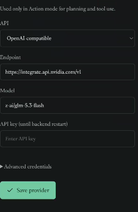
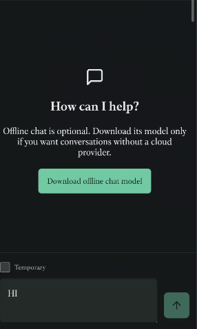
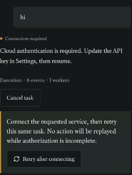

# Athera autonomous assistant architecture audit

Date: 2026-09-21

## Executive verdict

Athera has the beginnings of a serious assistant runtime, but the current product exposes its internal plumbing to the user. The main failure is not the choice of model. It is that conversation, planning, authentication, background execution, Android permissions, and recovery are represented as a few overloaded modes and statuses. That makes ordinary requests feel like configuration work.

Rig is a good fit for the provider boundary. It should replace repetitive provider HTTP clients, streaming parsers, and provider-specific message conversion. It should not replace Athera's orchestrator, policy engine, job ledger, Android scheduler, or approval semantics.

The target product should have one composer and one durable job system. A user states an outcome; Athera internally decides whether to answer directly, execute deterministic code, use Needle, use a cloud model, or ask one focused question. Models propose meaning and actions. Typed software owns authorization, side effects, retries, verification, and recovery.

## Evidence from the current experience

### 1. Provider setup leaks implementation details



The screen says the model is used only in Action mode and labels the key as lasting until a backend restart. This forces users to understand Athera's internal modes and process lifecycle. Credentials and provider health should instead be represented as a persistent connection with a visible test result, expiry/revocation state, and repair action.

### 2. The empty state points users toward a model they did not choose



The primary action is to download an offline model even though the intended product is cloud-first with Needle for lightweight on-device routing. The input remains visible but cannot work without the model-ready condition. This is especially costly on mobile and contradicts the chosen architecture.

### 3. Model authentication and tool connection are conflated



A simple greeting becomes a six-event task and then a generic connection problem. The upper message identifies cloud authentication; the recovery card says to connect a service. These are different failures with different owners and remedies.

## What went wrong architecturally

1. **The UI exposes the execution strategy.** `App.tsx` maintains an `actionMode` flag and presents Conversation and Action as user choices. Intent routing belongs behind the composer, not in navigation.
2. **Conversation is hard-gated on model availability.** `ConversationView.tsx` refuses submission unless a model reports `ready`. That prevents deterministic help, settings navigation, capability discovery, and Needle-supported routing from operating independently.
3. **Needle is a router, not a conversational fallback.** The Needle adapter is prompted to select a tool or call `request_assistance`; it cannot return a normal assistant response. When no suitable tool exists, the engine promotes the task from `Fast` to `Reasoner`, which explains why `hi` demands cloud authentication.
4. **One status means several unrelated blockers.** `WaitingForAuth` represents both provider credentials and connector OAuth. `TaskView.tsx` consequently tells every blocked task to connect a service.
5. **The process is not a background agent.** Android currently declares the activity, file provider, and SMS accessibility service, but no durable scheduling/foreground-work architecture. Rust startup recovery runs when the app runtime opens; it does not make the process continuously alive.
6. **The task runner serializes all tasks.** The engine uses one global runner mutex. Work-graph nodes may express parallelism, but independent jobs cannot truly progress concurrently.
7. **The release path has not been trustworthy.** The screenshots show behavior and copy that differ from the checked-in React source. Generated Android web assets have accumulated multiple hashed bundles. Until builds are reproducible and the installed artifact identifies its version, debugging product behavior is guesswork.
8. **Diagnostics are presented as product UX.** Event and worker counts are useful in a developer panel, not as the main recovery message for a user trying to say hello.
9. **The initial scope is too wide.** General app control, MCP, OAuth, files, adaptive rules, multi-agent work, local inference, cloud failover, and background autonomy are individually substantial products. Building all of them before proving a few complete jobs produced a broad engine with incomplete journeys.

## What is already worth preserving

- Vendor-neutral Rust contracts and thin provider adapters.
- Capability retrieval before inference and a bounded model context.
- Persisted tasks, events, results, approvals, and work graphs.
- Policy checks and retry-safety concepts around external writes.
- Startup recovery and replay protection.
- Keystore-oriented credential storage and secret-boundary checks.
- Versioned adaptive rules with rollback concepts.

These are strong infrastructure choices. The problem is that they are not yet assembled into a coherent user contract.

## The product architecture Athera needs

```text
Voice / text / share / notification / schedule
                     |
               Intent intake
                     |
       Deterministic task requirements
       (tools, risk, privacy, latency,
        background, network, cost)
                     |
          Capability retrieval (3-10)
                     |
        Strategy router, not a UI mode
          /        |        |       \
   direct code   Needle   cloud LLM   optional offline LLM
          \        |        |       /
             proposed work graph
                     |
                 PolicyEngine
          approve / deny / constrain
                     |
          durable Android job ledger
                     |
       execute -> observe -> verify
                     |
          notify, explain, and learn
```

The strategy router should produce typed requirements and provenance, not merely a `Fast` or `Reasoner` role. The policy engine must remain independent of model output.

### Required task states

Replace the overloaded authentication state with explicit blockers:

- `WaitingForProviderCredential { provider_id }`
- `WaitingForConnectorAuth { connection_id, scopes }`
- `WaitingForAndroidPermission { permission }`
- `WaitingForApproval { action_summary, risk }`
- `WaitingForUser { question, candidates }`
- `WaitingForDevice { constraint }`
- `Verifying`
- `OutcomeUnknown`

Retain ordinary `Draft`, `Ready`, `Running`, `Completed`, `Failed`, and `Cancelled` states. Recovery actions can then be deterministic and specific.

### Android execution model

Athera should be event-driven, not an immortal background process:

- Room/SQLite job ledger is the source of truth.
- WorkManager handles deferrable, guaranteed work.
- A foreground service handles a visible, user-started, ongoing job and always has a notification.
- AlarmManager is reserved for genuinely exact user-facing timing.
- Boot recovery reschedules eligible durable jobs.
- Notifications surface approvals, blockers, and completed outcomes.
- Optional server scheduling may use push to wake eligible work; it cannot bypass Android restrictions.

Android explicitly restricts background services and background foreground-service starts, so an always-running invisible agent is not a reliable design. WorkManager is the recommended scheduler for persistent work. See the [Android background-work restrictions](https://developer.android.com/develop/background-work/background-tasks/bg-work-restrictions) and [foreground-service start restrictions](https://developer.android.com/develop/background-work/services/fgs/restrictions-bg-start).

### Cross-app automation boundary

Prefer, in order:

1. Official app/service APIs and OAuth.
2. Android intents, shares, deep links, content providers, and notification actions.
3. A supervised accessibility adapter only for narrow deterministic flows with explicit consent and verification.

A general LLM-driven accessibility controller is not a sound Play Store foundation. Google Play prohibits non-accessibility-tool apps from using AccessibilityService to autonomously initiate, plan, and execute actions; deterministic user-authored automation is treated differently. See the [Google Play AccessibilityService policy](https://support.google.com/googleplay/android-developer/answer/10964491?hl=en).

## How Rig should be used

Rig now separates provider-neutral contracts (`rig-core`) from its classic agent runtime (`rig-agent`) and supports a broad provider set through one interface. That is a useful match for Athera's Rust provider boundary. See the [official Rig repository](https://github.com/0xplaygrounds/rig) and [Rig 0.41 architecture announcement](https://github.com/0xPlaygrounds/rig/discussions/2225).

### Adopt

- Provider clients and OpenAI-compatible transport.
- Canonical completion/message conversion.
- Streaming normalization.
- Tool-schema conversion where it reduces adapter code.
- Provider cassette/replay testing patterns.
- Exact, minimal crate features required by the mobile build.

### Do not delegate to Rig

- Athera task/work-graph authority.
- Policy, approval, and Android permission decisions.
- Credentials, OAuth lifecycle, or Keystore ownership.
- Exactly-once/idempotency guarantees for side effects.
- Background scheduling and process recovery.
- Preference learning and user-authored rules.
- Capability security or MCP trust boundaries.

### Safe integration shape

Add a `provider-rig` adapter that implements Athera's existing `ModelProvider` contract. The adapter owns Rig types and maps them into Athera's typed requests, events, capabilities, and normalized errors. No Rig object crosses into the UI, contracts crate, policy engine, or persistent task schema.

Start with `rig-core` or the smallest facade feature set needed for OpenAI-compatible chat and streaming. Pin the exact pre-1.0 version. Rig 0.41 itself shipped six breaking changes, so the adapter boundary is essential. Compile-test Android ARM64 and measure binary size before enabling more providers, vector stores, or media features.

`rig-agent` may later be evaluated for isolated, non-authoritative subagent inference. It should not become the top-level runtime while Athera already owns durable work graphs, policy, recovery, and user state.

## One assistant experience

Remove Conversation and Action modes. Keep one composer. Examples:

- “Hi” -> immediate local deterministic greeting or lightweight response; no cloud setup wall.
- “Message Arun that I am late” -> retrieve contacts, resolve ambiguity if necessary, show the selected recipient and message, request approval according to the user's policy, send, then verify.
- “Send that on WhatsApp” -> resolve the referent from task context, use a supported intent/share path, and report whether the handoff or send was actually confirmed.
- “Remind me tomorrow if they have not replied” -> create a durable conditional job with a visible trigger, timeout, and notification.

Provider selection belongs in a compact status detail such as “Using cloud model” or “Handled on device,” not in the primary navigation.

## Autonomy without losing control

Every background job needs an autonomy envelope:

- Objective and success condition.
- Allowed tools, apps, contacts, and data scope.
- Time, action-count, network, and cost limits.
- Approval policy and irreversible-action boundary.
- Stop conditions and escalation question.
- Verification evidence and undo path when possible.

This turns “be autonomous” into an enforceable contract rather than a prompt.

## Preference learning and self-improvement

Separate four concepts:

1. Observations: what happened.
2. Preferences: what the user tends to choose.
3. Rules: explicit scoped behavior the user approved.
4. Policy: non-overridable security and platform constraints.

One event must not silently become a permanent preference. Inferred preferences should be proposed, confidence-scored, scoped, versioned, expiring where appropriate, and reversible. A self-written skill should follow `proposal -> static validation -> sandbox/eval -> user review -> enable`. It must never grant itself permissions, enable disabled tools, or loosen policy.

## Recommended delivery order

### Phase 0: regain trust

- Make Android builds reproducible; remove stale bundles from packaged assets.
- Display build version/commit in diagnostics.
- Add provider save-and-test with typed error details.
- Store credentials in Android Keystore until expiry/revocation/deletion.
- Add an installed-artifact smoke test to CI.

### Phase 1: unify the assistant

- Remove modes and availability gating from the composer.
- Add typed blockers and recovery actions.
- Give Needle a bounded `Respond` outcome or add a deterministic local response path.
- Keep developer execution diagnostics behind a separate screen.

### Phase 2: make jobs durable

- Implement the Android job ledger bridge, WorkManager workers, foreground execution for visible long jobs, notifications, cancellation, and boot recovery.
- Replace the global runner mutex with per-task leases and resource locks.
- Add outcome verification and `OutcomeUnknown` handling before retrying writes.

### Phase 3: prove three complete jobs

1. Capture, remind, and follow up.
2. Resolve a contact and draft/send an SMS with safe approval; add app handoff paths next.
3. Parse/summarize a document and save/share the result.

Only expand general app automation after these work from request through background recovery and verification.

### Phase 4: introduce Rig behind the adapter

- Integrate one OpenAI-compatible provider first, including NVIDIA.
- Add replayable contract tests and provider capability tests.
- Measure APK size, startup, memory, cancellation, streaming, and TLS behavior.
- Add providers one by one without changing core task semantics.

### Phase 5: controlled adaptation

- Ship explicit personal rules first.
- Add preference proposals with accept/reject/undo.
- Shadow-evaluate generated rules and skills before activation.
- Build an audit screen answering: what happened, why, what data was used, and how to prevent it next time.

## Acceptance criteria for calling Athera an autonomous mobile assistant

- A user never selects Conversation versus Action.
- A greeting cannot be blocked by a connector-auth card.
- Provider failure does not erase or duplicate a job.
- A job survives process death and resumes only when policy says retry is safe.
- External writes have explicit idempotency or become `OutcomeUnknown` rather than being blindly replayed.
- The user can inspect, pause, cancel, and constrain every background job.
- Suggestions come from live task state and preferences, not generic prompts.
- No secret enters model context, ordinary SQLite fields, logs, traces, or fixtures.
- Accessibility is not the universal execution mechanism.
- The installed artifact can be traced to the exact tested build.

## Code evidence

- Mode split: [`App.tsx`](../../../apps/mobile/src/App.tsx#L34)
- Conversation model-ready gate: [`ConversationView.tsx`](../../../apps/mobile/src/ConversationView.tsx#L84)
- Generic auth recovery: [`TaskView.tsx`](../../../apps/mobile/src/TaskView.tsx#L180)
- Fast-to-reasoner escalation and shared auth state: [`engine.rs`](../../../crates/assistant-core/src/engine.rs#L218)
- Single runner mutex: [`engine.rs`](../../../crates/assistant-core/src/engine.rs#L18)
- Overloaded task status and default role: [`contracts`](../../../crates/contracts/src/lib.rs#L69)
- Needle's tool-or-handoff behavior: [`provider-needle`](../../../crates/provider-needle/src/lib.rs#L107)
- Startup-only recovery entry: [`app-runtime`](../../../crates/app-runtime/src/lib.rs#L182)
- Android components currently declared: [`AndroidManifest.xml`](../../../apps/mobile/src-tauri/gen/android/app/src/main/AndroidManifest.xml#L1)

## Bottom line

Do not restart the architecture around Rig. Put Rig behind Athera. The app's durable value is not “calling many LLMs”; it is turning an imperfect request into a safe, resumable, verifiable mobile job while learning the user's preferences without quietly gaining authority.
